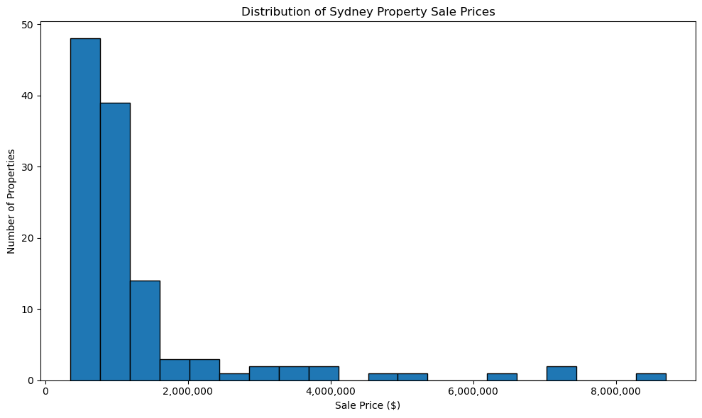
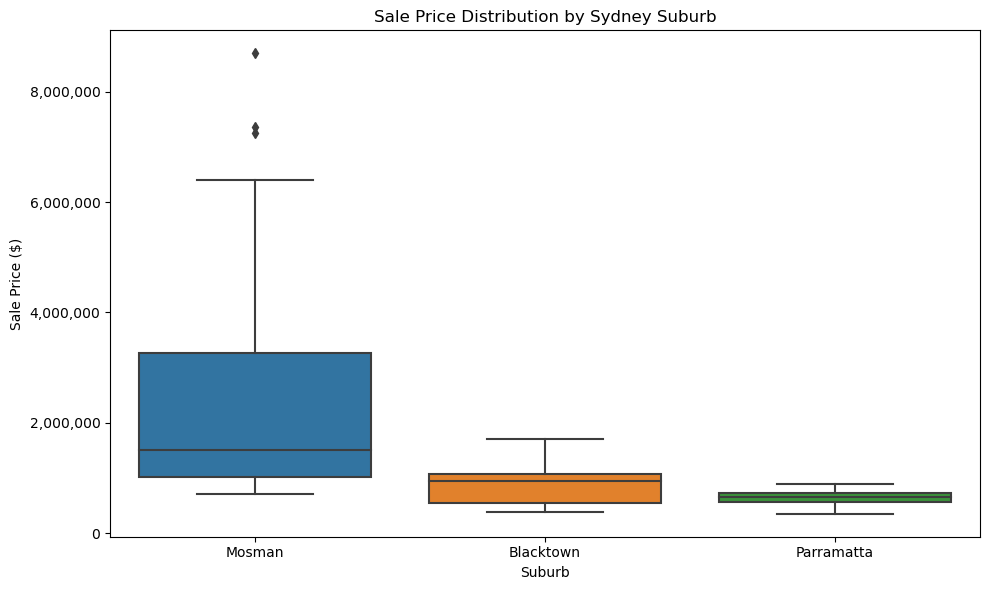
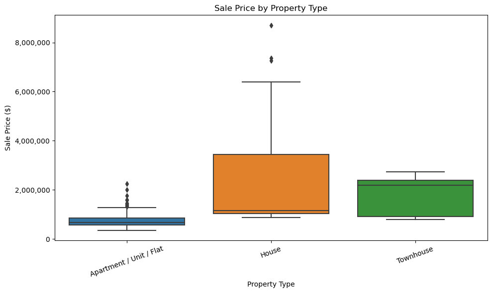
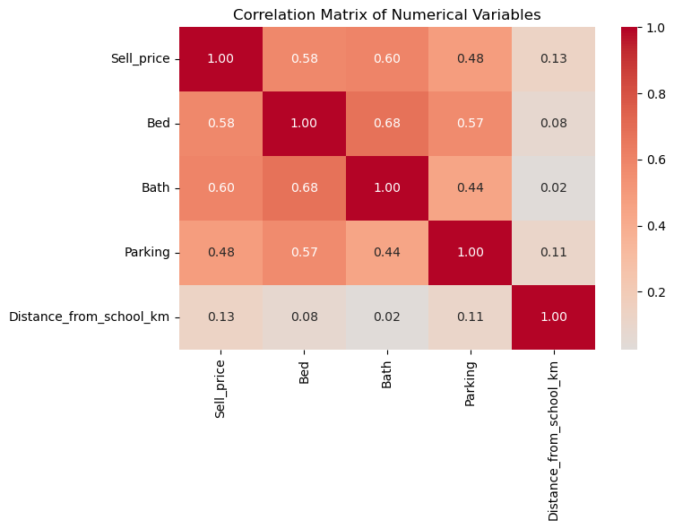
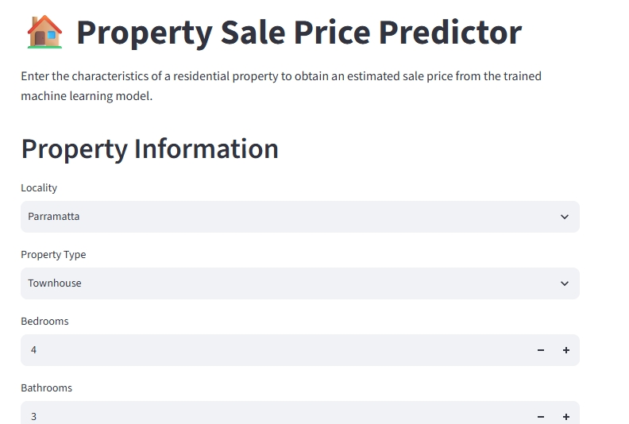
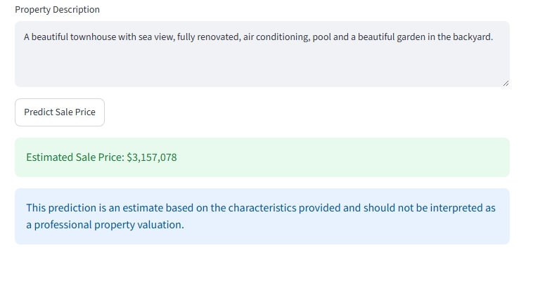

# Sydney Housing Price Prediction and Decision Support System
An end-to-end machine learning project for predicting residential property prices across selected Sydney suburbs, including exploratory analysis, feature engineering, model comparison, error analysis and an interactive Streamlit prediction application.

## Project Overview
This project develops a machine-learning-based property sale price prediction and decision-support application for selected Sydney suburbs: Mosman, Parramatta and Blacktown.

The final model is deployed through a Streamlit web application. Users can enter property characteristics and a property description to receive an estimated sale price.

The prediction is intended as a decision-support estimate and not as a professional property valuation.

## Business Problem Statement
Accurate property valuation is a critical requirement in the real estate industry, as it directly influences decisions related to buying, selling, leasing, and development. Real-estate consultants and stakeholders often face challenges when valuations are inconsistent or based on subjective judgment, leading to properties being underpriced or overpriced. Such discrepancies can distort market dynamics, reduce investor confidence, and hinder clients from achieving their desired real estate objectives.

The business problem we aim to address is the lack of a consistent, objective, and data-driven basis for property valuation. By incorporating key variables such as location, property characteristics, and prevailing market conditions, there is an opportunity to build a predictive model that supports consultants in delivering valuations that are both reliable and transparent. This solution would enable more informed decision-making, minimize risks associated with mispricing, and enhance overall efficiency in the real estate sector.

## Analytics Problem Statement
The objective of this project is to develop and deploy a machine learning–based property valuation system capable of predicting the sales price of residential properties with consistency and accuracy. The model aims to provide a data-driven benchmark for real estate decision-making by analyzing both structured and unstructured information.

On the structured side, the system will study explicitly available variables such as suburb, property type, number of bedrooms, bathrooms, parking availability, proximity factors, and sales timing. In addition, by leveraging Natural Language Processing (NLP), the system will extract key descriptive property characteristics from textual data (e.g., agent notes, property descriptions) that often play an equally important role in valuation assessments.

By integrating these diverse data sources into a predictive framework, the project seeks to create a robust valuation tool that minimizes subjectivity, enhances transparency, and supports real estate consultants and stakeholders in making informed, evidence-based decisions.

## Project Objectives
The project aims to:

1. Analyse housing-price differences across Mosman, Parramatta and Blacktown.
2. Identify variables associated with property sale prices.
3. Engineer meaningful structured features from property information.
4. Compare multiple regression approaches using cross-validation.
5. Analyse the largest prediction errors and model limitations.
6. Compare machine-learning estimates with LLM and human estimates.
7. Deploy the final model through an interactive Streamlit application.

## Dataset
The dataset was manually constructed using publicly available sold-property information from Domain.com.au, containing 120 residential property transactions with three Sydney suburbs selected to represent substantially different housing markets: Mosman, Blacktown and Parramatta.

| Suburb     | Properties |
|------------|-----------:|
| Mosman     | 40         |
| Parramatta | 40         |
| Blacktown  | 40         |
| **Total**  | **120**    |

Sale prices range from approximately $350,000 to $8.7 million.

The data was subsequently divided into:

- 96 training observations
- 24 held-out observations

The key variables used in dataset
- Sale date
- Locality
- Property type
- Bedrooms
- Bathrooms
- Parking
- Distance from school
- Property description

## Project Workflow
Data Collection
      ↓
Data Cleaning
      ↓
Exploratory Data Analysis
      ↓
Feature Engineering
      ↓
Preprocessing Pipeline
      ↓
Model Training
      ↓
Cross-Validation
      ↓
Model Comparison
      ↓
Error Analysis
      ↓
Final Model
      ↓
Streamlit Deployment

## EDA findings





## Feature Engineering
Several derived variables were created to provide additional information to the models, including bedroom/bathroom relationships and sale-period features.

Property descriptions were also transformed into structured binary features using keyword and regular-expression matching. Examples include the presence of a pool, garage, balcony, garden, views, renovation, air-conditioning, ensuite and built-in wardrobes.

## Preprocessing Pipeline
Scikit-learn pipeline was used to ensure consistent preprocessing across training and test data, avoiding manual manipulation.

- Numerical Features:
* Median imputation for missing values
* Standardisation with StandardScaler

- Categorical Features:
* Most frequent imputation for missing values
* One-Hot Encoding with unknowns ignored

- Integration:
* Combined via ColumnTransformer so transformations are applied automatically and  reproducibly during model training and evaluation.

## Model Selection
Three regression approaches were selected to represent progressively more flexible modelling strategies.  
1. Linear Regression was selected as a baseline because it provides a simple and interpretable representation of the relationship between property characteristics and sale price. However, its assumption of linear relationships may be restrictive given the likely nonlinear interactions between locality, property type and property characteristics. 
2. Decision Tree Regression was selected to capture nonlinear relationships and interactions without requiring a predefined functional form. Its main limitation is that individual trees can become highly sensitive to the training data and therefore overfit, particularly with a relatively small dataset. 
3. Random Forest Regression was selected as an ensemble approach that combines multiple 
decision trees. It was expected to provide better generalisation than a single tree by reducing variance while retaining the ability to model nonlinear relationships and interactions. Given the dataset's small sample size, mixed numerical and categorical variables, substantial price variation and apparent nonlinear relationships, Random Forest was expected to perform best.

## Model-performance Table
| Model             | Validation MAE  | Validation RMSE  | Validation R² | 
|-------------------|-----------------|------------------|---------------|
| Linear Regression | $538,699        |$793,862          |0.35           |
| Decision Tree     | $422,533        |$923,044          |-0.01          |
| Random Forest     | $395,599        |$761,341          |0.61           |

Random Forest provided the strongest validation performance, achieving the lowest MAE and RMSE and the highest validation R².

Random Forest Training R² = 0.81
Random Forest Validation R² = 0.61

Training RMSE = $616,525
Validation RMSE = $761,341

For the Random Forest model, training performance (R² = 0.81) and validation performance (R² = 0.61) indicates some overfitting and a moderate generalisation gap. However, Random Forest still demonstrated stronger validation performance than the alternative models.

## Error Analysis
From the selected Random Forest model we studied the prediction errors to investigate where model failed.
### Five-largest-errors
The five largest prediction errors were identified using the out-of-fold predictions, the analysis ranked observations by absolute prediction error, allowing the model's largest failures to be investigated without relying on predictions from observations used to train 
the corresponding model.  
| Property                  | Actual Price    | Predicted Price  | Absolute Error | % Error |
|---------------------------|-----------------|------------------|----------------|---------|
| 5 Botanic Road, Mosman    | $8,700,000      | $2,527,000       | $6,173,000     | 70.95%  |
| 2 Morella Road, Mosman    | $7,360,000      | $3,564,929       | $3,795,071     | 51.56%  |
| 5 Central Avenue, Mosman  | $6,399,000      | $3,588,679       | $2,810,321     | 43.92%  |
|11 Euryalus Street, Mosman | $7,260,000      | $4,684,354       | $2,575,646     | 35.48%  |
|14 Almora Street, Mosman   | $5,025,000      | $2,488,104       | $2,536,896     | 50.49%  |

All five properties belonged to same suburb where the model substantially underpredicted the sale price, with errors ranging from approximately $2.54 million to $6.17 million. On studying the details of these properties we were able identify that while the model captures basic observable property characteristics but struggles with the premium associated with highly desirable, heterogeneous properties. In particular, the structured dataset does not adequately represent factors such as land size, internal floor area, harbour views, beach proximity, renovation quality, architectural quality, premium fittings, outlook, development potential and micro-location. The five failures also demonstrate that high-end properties are particularly difficult to model. Their sale prices can be substantially influenced by unique attributes that are not reflected by simple variables such as bedrooms, bathrooms and parking. The model therefore appears to regress extreme properties towards the broader Mosman price distribution rather than recognising the substantial premium attached to exceptional properties.

This finding also explains why the model's overall validation performance should be interpreted 
cautiously. A prediction may be useful as a benchmark for conventional properties but considerably less 
reliable for luxury, waterfront, architect-designed, extensively renovated or otherwise unique properties. 
For these properties, professional valuation and additional property-specific information remain 
important.

### Error Analysis by Property Type and Suburb
#### Property type
| Property Type           |      MAE |
| ----------------------- | -------: |
| House                   | $927,083 |
| Townhouse               | $242,649 |
| Apartment / Unit / Flat | $163,085 |

#### Suburb
| Suburb     |      MAE | Mean % Error |
| ---------- | -------: | -----------: |
| Mosman     | $812,494 |       28.09% |
| Blacktown  | $284,524 |       32.59% |
| Parramatta |  $89,780 |       15.96% |

Prediction difficulty varied substantially across property types and suburbs, with houses and Mosman properties producing considerably larger absolute errors.

## ML vs LLM vs Human comparison
To assess whether automated valuation can replace or complement human judgement, ten properties were selected and independently valued using three approaches: the selected Random Forest model, a large language model (LLM), and human judgement based on the property information and market insights developed during the project. The three estimates were then compared with the actual sale prices using absolute error, RMSE and percentage error.
| Method           |      MAE |     RMSE | Mean % Error |
| ---------------- | -------: | -------: | -----------: |
| Machine Learning | $255,554 | $486,150 |       28.96% |
| LLM              | $169,350 | $197,381 |       21.19% |
| Human            | $162,510 | $191,675 |       23.00% |

The comparison was conducted on only 10 properties and should therefore be interpreted as an exploratory comparison rather than evidence that one estimation method is generally superior. However, the results show that human judgement achieved the lowest MAE and RMSE, although the LLM produced the lowest mean percentage error. The machine-learning model performed considerably worse on this small comparison set, with an MAE of approximately $256,000 and RMSE of approximately $486,000. However, when we went deeper into the property level result we found that no single approach consistently produced the closest estimate. The ML model was the best method for five of the ten properties, human judgement was best for three, and the LLM was best for two.

## Final Model Configuration
| Parameter               | Value                   |
| ----------------------- | ----------------------- |
| Model                   | Random Forest Regressor |
| n_estimators            | 300                     |
| max_depth               | 6                       |
| min_samples_leaf        | 3                       |
| max_features            | sqrt                    |

## Saved Prediction Pipeline
The final preprocessing and Random Forest model were saved together as a single joblib pipeline (`property_price_model.pkl`).

This allows the Streamlit application to apply the same transformations used during model development before generating a prediction.

The deployed workflow is:
Raw property inputs → feature engineering → preprocessing → Random Forest → estimated sale price.

Saving preprocessing and modelling steps together helps ensure that the transformations applied during inference remain consistent with those used during training

## Streamlit Application
The trained prediction pipeline was deployed as an interactive Streamlit application that allows users to enter property characteristics and obtain an estimated sale price.

### Application Inputs
Users can provide:
- Locality
- Property type
- Bedrooms
- Bathrooms
- Parking
- Distance from school
- Sale year and month
- Property description

The property description is processed to identify characteristics such as pool, garage, balcony, garden, views, renovation, air-conditioning, ensuite, built-in wardrobes and courtyard.

### Prediction Workflow
User inputs
→ Feature engineering
→ Text-based feature extraction
→ Saved preprocessing pipeline
→ Random Forest model
→ Estimated sale price

The application loads the trained pipeline from `model/property_price_model.pkl`; the model is not retrained during prediction.

### Application Interface



### Live Demo
[Launch the Streamlit Application](https://sydney-housing-price-prediction-portfolio.streamlit.app/)

> **Disclaimer:** The predicted price is intended as a reference point generated by the machine-learning model and should not be considered a professional property valuation or financial advice.

## Repository Structure
Sydney_Housing_Price_Prediction_Portfolio/
│
├── app.py
├── README.md
├── requirements.txt
├── .gitignore
│
├── Data/
│   ├── Sydney_house_price.xlsx
│   ├── Sydney_house_price_processed.xlsx
│   ├── training_dataset.xlsx
│   ├── training_target.xlsx
│   └── test_dataset.xlsx
│
├── Model/
│   └── property_price_model.pkl
│
├── Notebook/
│   └── Sydney_Housing_Price_Prediction.ipynb
│
├── Images/
│   ├── price_distribution.png
│   ├── price_by_suburb.png
│   ├── price_by_property_type.png
│   ├── correlation_matrix.png
│   ├── Streamlit_app1.png
│   └── Streamlit_app3.png

## Installation Instructions
#### 1. Clone the repository

Clone the repository to your local machine using Git:

```bash
git clone https://github.com/Kartik1Trivedi/Sydney_Housing_Price_Prediction_Portfolio.git
```

Navigate to the project directory:

```bash
cd Sydney_Housing_Price_Prediction_Portfolio
```

#### 2. Create a virtual environment

It is recommended to use a virtual environment to keep the project's dependencies isolated.

On Windows:

```bash
python -m venv venv
venv\Scripts\activate
```

On macOS/Linux:

```bash
python3 -m venv venv
source venv/bin/activate
```

#### 3. Install the required dependencies

Install the project's Python dependencies using the provided `requirements.txt` file:

```bash
pip install -r requirements.txt
```

#### 4. Run the Streamlit application

Start the Streamlit application using:

```bash
streamlit run app.py
```

The application will open in your default web browser. If it does not open automatically, use the local URL displayed in the terminal.

#### 5. Run the Jupyter Notebook

The analysis and model development notebook is located in the `Notebook/` directory.

To launch Jupyter Notebook:

```bash
jupyter notebook
```

Then open:

```text
Notebook/Sydney_Housing_Price_Prediction.ipynb
```

The repository also contains the datasets, trained model, and project images required for the analysis and application.


## Limitations
For this project, major limitations include:
- Only 120 observations.
- Only three suburbs included.
- Manually collected sample of 120 sold properties, with 40 observations from each selected suburb.
- Small representation of high-end properties.
- Limited geographic information.
- Absence of variables such as precise coordinates, land size or richer property-quality measures where unavailable.
- High variability in premium Mosman houses.
- Exploratory ML/LLM/human comparison based on only 10 properties.

## Scope of Future Improvements
The areas of improvement include:
- Expand the dataset across additional Sydney suburbs
- Collect substantially more historical sales
- Include latitude/longitude and proximity to transport, CBD and amenities
- Add land area and building-area variables
- Improve extraction of information from property descriptions using NLP
- Investigate gradient-boosting models such as XGBoost or LightGBM
- Perform hyperparameter optimisation
- Add prediction intervals rather than only point estimates
- Monitor model performance across property-market regimes

## Technologies Used
Python
Pandas
NumPy
Scipy
Scikit-learn
Matplotlib
Seaborn
Jupyter Notebook
Joblib
Streamlit
Git / GitHub

## Author
Kartik Trivedi
Data Science & Analytics